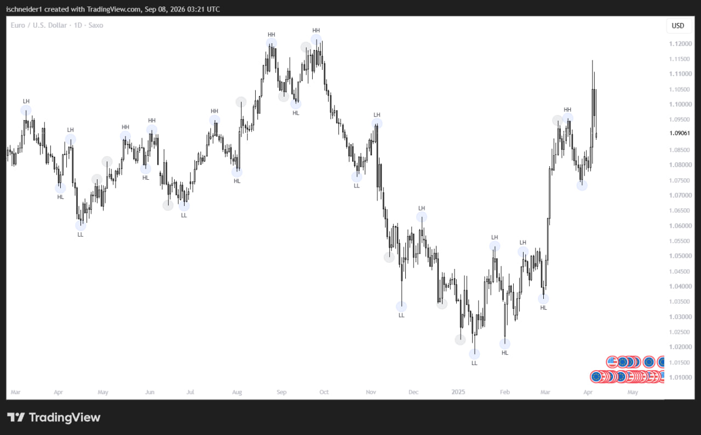
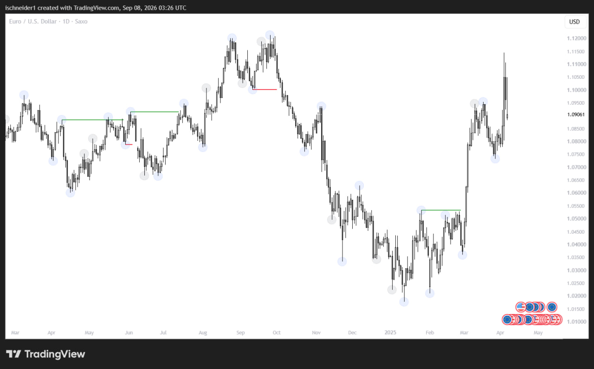
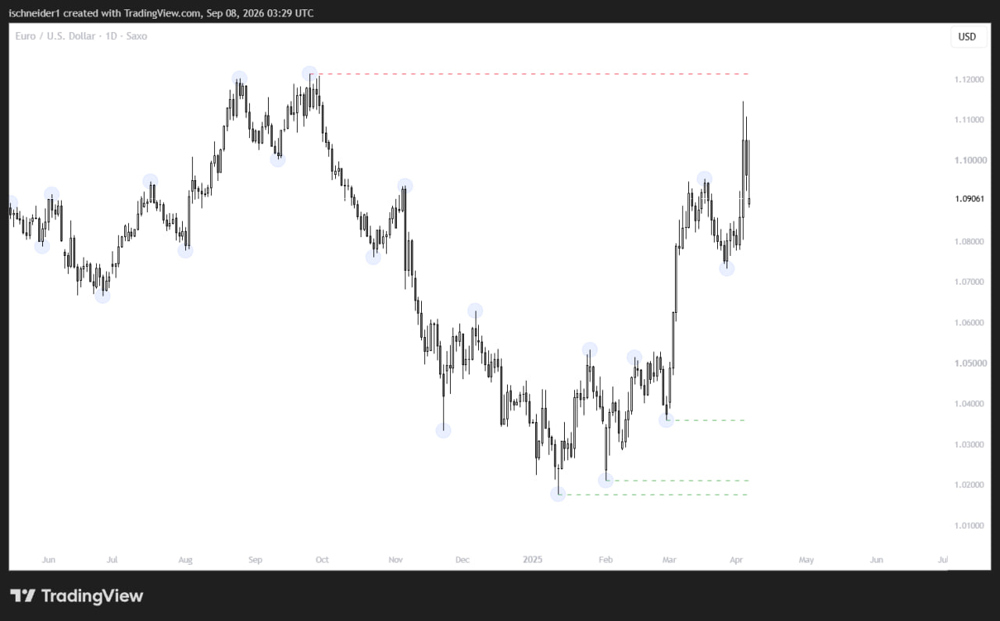
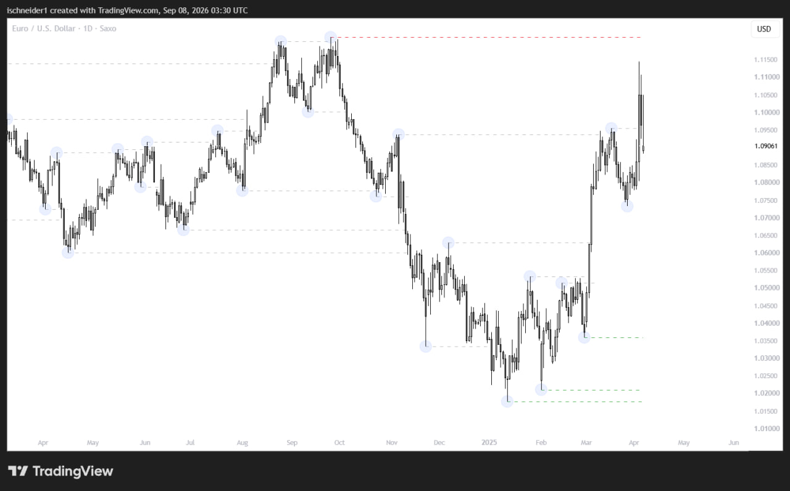

# SMC Market Structure Toolkit

A Python research toolkit for converting selected Smart Money Concepts (SMC / ICT) ideas into deterministic and reproducible algorithms.

The purpose of project is not to provide trading signals or claim profitability, but to explore how concepts that are often interpreted visually and subjectively can be represented in code without introducing lookahead bias.

The current implementation focuses on:

- Swing High / Swing Low detection
- Structural swing confirmation
- HH / HL / LH / LL classification
- Break of Structure (BOS)
- Structural liquidity pools
- Chronological event processing

Strategy-specific setup logic, entries, exits, position sizing, and the backtesting engine are intentionally excluded.

Detailed representation and logic behind implementation can be viewed inside src\README.md

---

## Motivation

Many SMC concepts are straightforward to recognize visually but become ambiguous when translated into deterministic rules.

Questions immediately appear:

- When exactly does a swing become known?
- What qualifies a swing as structural rather than local noise?
- When does a structural level become available to an algorithm?
- Can several structural events become confirmed on the same candle?
- What exactly constitutes a Break of Structure?
- Which swing points should be treated as liquidity?
- How do we avoid using information that was not yet available at the time?

This repository represents one attempt to answer those questions consistently.

It should be viewed as a research implementation rather than a definitive interpretation of SMC.

---

# Repository Structure

```text
SMC-Market-Structure-Toolkit/
│
├── config.py
├── data_loader.py
├── market_structure.py
├── liquidity.py
├── README.md
└── ...
```

### `config.py`

Contains configurable parameters used by the structural algorithms, primarily:

- `lookback`
- `lookforward`

These parameters control raw swing detection and allow experimentation with different levels of structural sensitivity.

### `data_loader.py`

Loads and prepares OHLC market data into the format expected by the toolkit.

The structural algorithms expect chronologically ordered candle data containing at least:

```text
Open
High
Low
Close
```

### `market_structure.py`

Contains the main market-structure pipeline:

```text
Raw candles
    ↓
Raw swing identification
    ↓
Structural swing confirmation
    ↓
HH / HL / LH / LL labeling
    ↓
Chronological structural-event processing
    ↓
Break of Structure detection
```

### `liquidity.py`

Uses confirmed structural highs and lows to construct and track structural liquidity pools.

---

# TradingView Indicators

Visual versions of selected tools are published on TradingView for chart-based inspection and validation.

- [Market Structure Indicator](https://www.tradingview.com/script/wsjq882z-SMC-Structure-Identification/)
- [Liquidity Indicator](https://www.tradingview.com/script/m6i0HG9x-Liquidity-Pools/)

These indicators are intended as visualization tools for current logic implemented in Python.

## Examples







---

# Research Limitations

This project should not be interpreted as proving that SMC concepts are profitable.

It only provides deterministic implementations that can be used for experimentation and backtesting.

Important limitations include:

- SMC terminology does not always have universally agreed definitions.
- Different parameter values can produce different structural interpretations.
- OHLC data does not reveal exact intrabar event ordering.
- Structural swing liquidity is only one possible definition of liquidity.
- Transaction costs, execution, and trading strategy behavior are outside the scope of this repository.
- The implementation represents my current research interpretation and may change as testing continues.

---

# Planned Development

Potential future additions include:

- Order Blocks (OB)
- Fair Value Gaps (FVG)
- Optimal Trade Entry (OTE)
- Market-data acquisition and normalization tools
- Visualization examples

The exact roadmap may change as the underlying research develops.

---

# Disclaimer

This repository is intended for educational and quantitative-research purposes.

It is not financial advice, a trading recommendation, or a claim that the implemented concepts have predictive or profitable value.